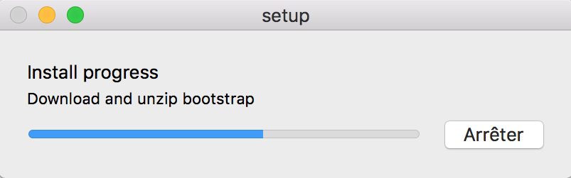
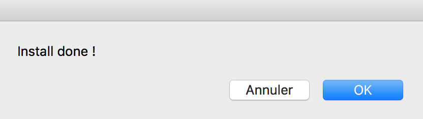
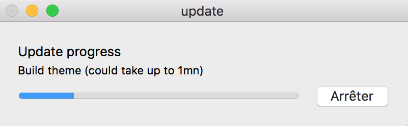
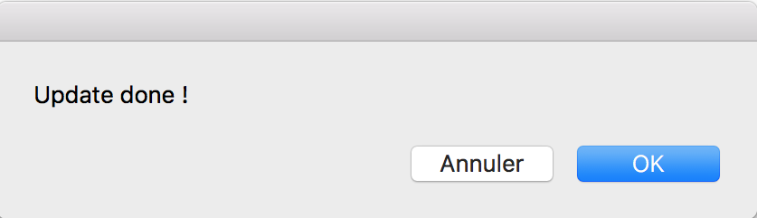
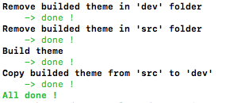

# Bootstrap build - toolkit for macOS

**/!\ macOS only**

**Versions : Bootstrap 4.0.0-beta.2 | Node.js v8.9.2**

**All .app needs admin privilege in order to remove created temp file**

## Setup

1. Launch `getNode.app` to get node.js if you don't have it and once the installer is open fullfill installation.

2. Launch `setup.app`

   A popup like this should open :

   

   If everything goes well the following popup should appear :

   

## How to use ?

1. Edit source in `src`

2. Build theme via `update.app`

A popup like this should open :

If everything goes well the following popup should appear :

You can test your edit by openning  `dev/index.html` (don't forget to clear cache)

## Further readings

https://getbootstrap.com/docs/4.0/getting-started/introduction/

https://getbootstrap.com/docs/4.0/getting-started/build-tools/

http://sass-lang.com

## NB 
1. Everything could be done via command line by running `install.sh` (only do `npm install`) and `update.sh` (do `npm run dist`) you should get the following results for `update.sh` :

   

2. All .app are applescript and could be edited in macOS `Script Editor.app`

## Troobleshooting

If it seems to not work (.app are failing) try running the `.app` by openning it in macOS `Script Editor.app` (ie push ▶ button)